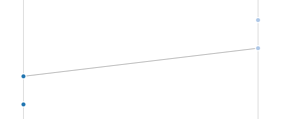
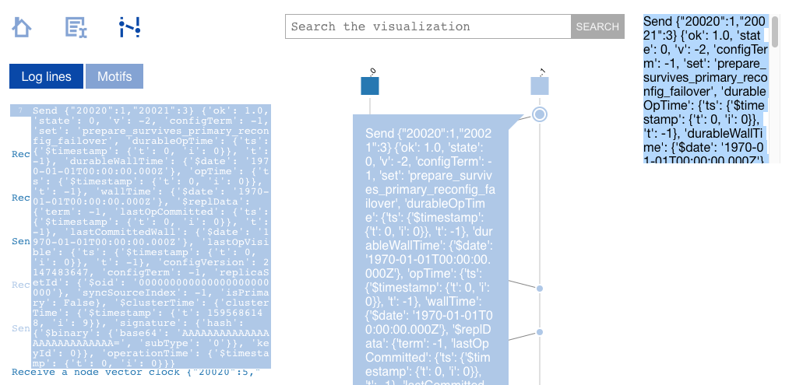
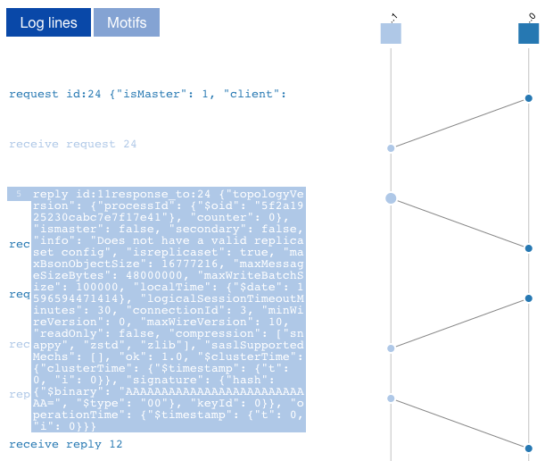

MongoDB Resmoke Test Space-Time Diagram
=======================================

Visualizes the execution of a MongoDB resmoke.py test (e.g., a test run in
Evergreen) as a "space-time diagram" in the style of Lamport's "Time, clocks,
and the ordering of events in a distributed system".

## Instructions

Build MongoDB from my fork and branch:

https://github.com/ajdavis/mongo/tree/space-time-diagram-client-metadata

Enable tcpdump on all ports your cluster will use on the local host, e.g.:

```
sudo tcpdump -Xs0 -Nnpi any -w ~/mongo.pcap "port (27017 or 27018 or 27019)"
```

Select some JS test to run:

```
python3 buildscripts/resmoke.py run --suites=replica_sets \
    jstests/replsets/prepare_survives_primary_reconfig_failover.js \
    > prepare_survives_primary_reconfig_failover.log
```

Terminate `tcpdump` with Control-C, then run:

```
python3 process-logs.py mongo.pcap prepare_survives_primary_reconfig_failover.log > shiviz.txt
```

Open [ShiViz](https://bestchai.bitbucket.io/shiviz/) and upload the `shiviz.txt`
you just created.

## Development history

Goals:

1. Draw a line for each message sent between nodes
2. Place server log messages on the same time axis as the message lines

### Try 1: ShiViz with a vector clock

ShiViz requires a traditional vector clock included with each message. I added a vector clock to MongoDB in the [node-vector-clock branch of my fork](https://github.com/ajdavis/mongo/tree/node-vector-clock), and log the vector clock value each time a message is sent or received. (Messages are sent on many code paths, I missed a couple.)

#### ShiViz ignores out-of-order messages

This fails Goal 1. If node A sends Messages One and Two to Node B, and Node B then processes Messages Two then One, ShiViz believes that Message One's late delivery is irrelevant and doesn't draw a line for it:



Explanation: Imagine Message One's clock is `{A: 1, B: 1}`. Then Message Two's clock must be `{A: 2, B: 1}`. When Node B receives Message Two it updates its clock to `{A: 2, B: 2}`, and when it receives Message One it updates its clock to `{A: 2, B: 3}`, because the "A" hand in Message One is less than Node B's current "A"hand. Since Node B's "A" hand doesn't move, ShiViz doesn't see it has received a message.

If the vector clock completely captured all state this would be correct (Message One is obsolete when it arrives), but Goal 1 is to draw lines for **all** messages.

Goal 2 is a disappointment, too. ShiViz shows each event description awkwardly, in a tooltip or a small box. We need a better way to scroll through and read the original log lines.



## Try 2: Draw space-time diagram with requestId and responseTo

Instead of a vector clock with ShiViz, update MongoDB to log all messages' requestId and responseTo. On the wire, requestId and responseTo correlate messages, but MongoDB doesn't log them all. It logs `RemoteCommandRequestBase::id` as "requestId", but that is an internal id. The real requestId is formed by calling `nextMessageId()` in `AsyncDBClient::runCommand`, so I [updated MongoDB to log both ids](https://github.com/ajdavis/mongo/tree/space-time-diagram) from that method. When the reply arrives, the network stack doesn't pass the real requestId or the reply's responseTo back up the layers. In an ideal solution those would be added to `ReplyInterface`, then passed upwards and copied into `RemoteCommandResponseBase`, where it can be logged alongside the decoded reply BSON.

I wrote a Python script to post-process these logs, and started to write a space-time diagram renderer based on [Vector.js](https://vectorjs.org/), which seemed promising.

## Try 3: Server-side traffic capture

Use traffic capture instead of logging. Start mongod with  `--setParameter enableTestCommands=1 --setParameter AlwaysRecordTraffic=foo --setParameter trafficRecordingDirectory=/tmp/traffic`, it creates `/tmp/traffic/foo` in a format inferrable from traffic_recorder.cpp. (Or read "Scope: Server-Side Traffic Capture". See also shell method convertTrafficRecordingToBSON.) I used jBinary and jDataView to try parsing in Javascript, but found difficulties, perhaps a jDataView bug?

I tried parsing in Python. "electionTime" can exceed what PyMongo considers a normal timestamp, it throws "bson.errors.InvalidBSON: Python int too large to convert to C int" when decoding, because e.g. millis = 6854948369136091137. This comes from `ReplicationCoordinatorImpl::_postWonElectionUpdateMemberState`, which executes:

    auto ts = VectorClockMutable::get(getServiceContext())->tickClusterTime(1).asTimestamp();
    _topCoord->processWinElection(_electionId, ts);

I can hack up my local copy of PyMongo's `_millis_to_datetime` to return "millis" instead of converting to a datetime. Still not good enough for Goal 1: we only know when a server **receives** a message and replies. We don't know the time at which it **sends** a request and or receives a reply.

## Try 4: Command tracking

Use Misha's command dependency tracking in tracking_metadata.cpp. Start mongod with `{'logComponentVerbosity': '{"command": 2, "network": 2, "tracking": 2}'}`. This only initiates tracking from shard_remote.cpp requests - such requests are logged when outgoing from mongos and incoming to mongod. For Goal 1, we also need to log outgoing and incoming **replies**, plus initiate tracking in async_client.cpp, DBClientConnection, and everywhere else that intra-cluster traffic originates.

## Try 5: tcpdump 

Use tcpdump to capture intra-cluster traffic. This captures all messages and their send/receive times. We need to post-process the traffic captures to determine where messages originate: if a client opens a connection to mongod, we don't know if the client is the shell or another mongod, and we don't know **which** mongod sends the message. Write a Python script to ingest the pcap file and mongod logs, analyze them to discover the origin of all messages. Discard messages from the shell.

The script then **fakes** a vector clock to produce a ShiViz-compatible input file:



This is the most successful try yet; however, we still haven't fulfilled Goal 1. The "ShiViz ignores out-of-order messages" problem isn't solved. And reading log messages in ShiViz is still very awkward.

Future direction: continue using tcpdump plus server logs, but write our visualization that combines a space-time diagram rendered with Vector.js, and displays logs with Lobster.