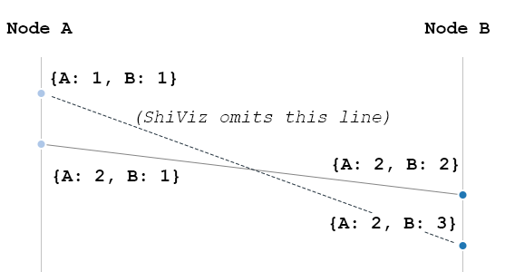

MongoDB Build Failure Log Visualization With ShiViz
===================================================

Instructions
------------

Clone MongoDB from Jesse's fork and branch:
```
git clone -b node-vector-clock git+git@github.com:ajdavis/mongo.git
```

Build the server and select some JS test to run:

```
python3 buildscripts/resmoke.py run \
    --suites=replica_sets \
    jstests/replsets/prepare_survives_primary_reconfig_failover.js \
    > log.txt
```

Use the script included in this project to generate a ShiViz-compatible log:

```
python3 -m bf_log_to_shiviz log.txt > shiviz.txt
```

Load the ShiViz-compatible log in [ShiViz](https://bestchai.bitbucket.io/shiviz/).

Status
------

This might be a failed experiment. There are a few problems with ShiViz for
MongoDB build failure diagnosis.

If Node A sends Messages One and Two to Node B, and Node B processes Message
Two then Message One, ShiViz draws only one line between A and B, and considers
the other send/receive events to be process-local:



Imaging Message One's clock is `{A: 1, B: 1}`. Then Message Two's clock must be
`{A: 2, B: 1}`. When Node B receives Message Two it updates its clock to `{A:
2, B: 2}`, and when it receives Message One it updates its clock to `{A: 2, B:
3}`, because the "A" hand in Message One is less than Node B's current "A"
hand. Since Node B's "A" hand doesn't move, ShiViz doesn't see it has received
a message. Underlying this problem is a deeper one: ShiViz assumes all messages
are the same, so a later message completely supersedes a previous one if they
are received out of order. But in MongoDB, messages are of many types, so even
if a message has a stale vector clock value, the receiving node may
nevertheless change state, so we need to see an arrow that represents it.

The other problem with ShiViz is that each event description is shown
awkwardly, in a tooltip or a small box. We need a better way to scroll through
and read the original log lines.


